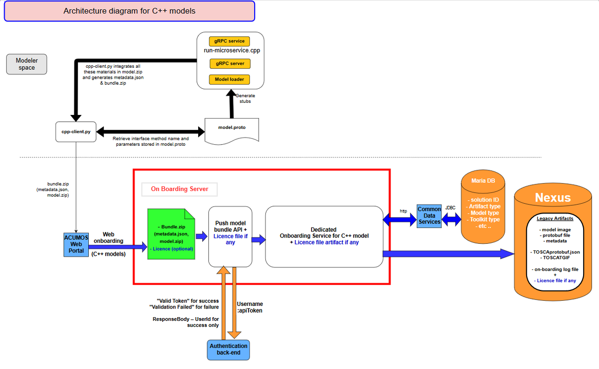

.. ===============LICENSE_START=======================================================
.. Acumos CC-BY-4.0
.. ===================================================================================
.. Copyright (C) 2017-2018 AT&T Intellectual Property & Tech Mahindra. All rights reserved.
.. ===================================================================================
.. This Acumos documentation file is distributed by AT&T and Tech Mahindra
.. under the Creative Commons Attribution 4.0 International License (the "License");
.. you may not use this file except in compliance with the License.
.. You may obtain a copy of the License at
..
.. http://creativecommons.org/licenses/by/4.0
..
.. This file is distributed on an "AS IS" BASIS,
.. WITHOUT WARRANTIES OR CONDITIONS OF ANY KIND, either express or implied.
.. See the License for the specific language governing permissions and
.. limitations under the License.
.. ===============LICENSE_END=========================================================

===========================
On-Boarding Developer Guide
===========================

This is the developers guide to Onboarding.

**1: Target Users**
-------------------

This guide is targeted towards the open source user community that:

1. Intends to understand the backend functionality of the Onboarding.

2. Intends to contribute code to enhance the functionality of the Onboarding.

**2: Assumptions**
------------------

It is assumed that the ML Models contributed by the open source community an created under Java 8 or
9, Python>=3.5, <3.7 or R>=3.4.4  :

1. Provide the basic request response style of communication.

2. Can be converted in Microservices.

3. Are capable of communicating via Http REST mechanism.

**3: Onboarding High level Design Architecture**
------------------------------------------------
Below is high-level flow of model onboarding

|image1|

For models developed in Java, Python and R the data scientist will use the Acumos client library to
create some artifacts embeded them in a model bundle. This model bundle can be pushed to the platform
by using WEB on-boarding or command line (CLI) thanks to REST interface exposed by the Acumos
onboarding server.

|image1bis|

For model in a model interchange format like ONNX and PFA only web interface is useable to upload
them in the platform. For the moment micro-service generation cannot be triggered for ONNX and PFA
models.

|image1ter|

For model Dockerized and stored in repo outside Acumos (like for example Docker hub) you can save the
model URI in Acumos. You can also dockerize your models by yourself and on-board them in Acumos.

**4: Onboarding Low Level Design for R, Java, Python, ONNX and PFA models**
---------------------------------------------------------------------------

For models created with R, Java or Python, Data scientists must use Acumos-client-library specific
to the toolkit type to push the model to Acumos platform. The client library creates first the model
bundle composed of model binary, metadata file and protobuf definition for model input/output. Then
data scientists can choose to onboard the model bundle by WEB on-boarding or CLI on-boarding
(Common Line Interface). The onboarding server invokes TOSCA generator to generate TOSCA files for the
model and uploads these to Nexus. Onboarding server authenticates incoming request and then pushes
model artifacts to nexus docker registry. By default micro-service is created but modelers have the
possibility to skip this step and do it later . When Onboarding server invokes microservice generation
API to generate docker image for the model, the microservice generation component creates docker image
and uploads it in Nexus docker repository.

For models in a model interchange format like ONNX or PFA, only web onboarding can be used as there
is no specific Acumos-client-library for these kinds of models. In that case, modeller has to use the
web onboarding interface to upload their model. Onboarding server authenticates incoming request and
then pushes the model to nexus.

You can on-board your model with a license. Whatever the case, CLI or WEB on-boarding, if the license
file extension is not 'json' the license on-boarding will not be possible and if the name is not
'license' Acumos will rename your license file as license.json and you will see your license file as
"license-1.json" in the artifacts table. If you upload a new version of your license through the portal,
the license number revision will be increased by one like that "license-2.json". To help user create
the license file expected by Acumos a license user guide is available here :
`License user guide <../../security-verification/license-manager-client-library/docs/user-guide.html>`_

- Architecture diagramm for R, Java, Python, ONNX and PFA models

|image0|

- On-boarding use case

Below, the data scientist’s model is wrapped to produce a standardized native model. Depending on
the input model, only a subset of standard model interfaces may be supported.

Acumos can then generate a microservice however it wishes. The underlying generic server can only
interface with the inner model via the wrapper. This decoupling allows us to iterate upon and
improve the wrapper independently of Acumos.

|image3|

- On-boarding Model Artefact

Model artifacts must provide sufficient metadata that enables Acumos to instantiate runtimes,
generate microservices, and validate microservice compositions. The proposed solution is to split
the model artifact into public and private components.

Public :

- Understood by  Acumos. Includes metadata on:

- Model methods and signatures

- Runtime information

Private :

- Opaque to  Acumos but understood by the wrapper library.

- Includes: Serialized model

- Auxiliary artifacts required by wrapper library

- Auxiliary artifacts required by model

By splitting the artifact into public and private pieces, the wrapper library has the freedom to
 independently iterate and improve.

|image4|

**5: Onboarding Low Level Design for Dockerized model and Dockerized model URI**
--------------------------------------------------------------------------------

Data scientist can also create models in the language of their choice then dockerized their models
themselves and onboard these dockerized models or dockerized model URI. Of course for these kinds of
models the microservice generation process is not triggered. Below is the low level design for these
models.

Data scientists can on-board a license, in the same way as previously explained, only with the Dockerized
model URI as we assume that for Dockerized model the license has been embeded in the Docker image.

- Architecture diagramm for Dockerized model and Dockerized model URI

|image0bis|

On-boarding with license is only possible for Dockerized model URI, with the same rules explained above,
as we assume that modelers will embed their licence in their Docker image for the Dockerized model.

Whatever the kinds of models :

- New solution is created in common database for a new model.
- Existing solution is updated with, a new revision. Revision is updated with artefact details and
those artefacts are uploaded to nexus maven repository.

**6: Onboarding Low Level Design for C++ model**
------------------------------------------------

C++ model can also be onboarded in Acumos, the main difference with other models coming from R, python or 
java language is that there is no model runner for C++ model, so Acumos user must write a short C++ program
that attaches the trained model with the generated gRPC stub in order to build an executable that contains
the gRPC webserver as well as the trained model. This executable will then be started in the docker container.

- Architecture diagramm for C++ model

|image6|

**6: Onboarding Setup**
-----------------------

Steps:

1: Clone the code from Gerrit Repo: https://gerrit.acumos.org

Browse the repositories to find on-boarding project then use the HTTPS, HTTP or SSH git clone commande line.

2: After cloning import this project in your recommended IDE like STS.

3: Take the maven update so that you can download all the required dependencies for the Onboarding Project.

After doing maven update you can run or debug the code by using Spring Boot App but before that
we need to set the Environment Variables in our IDE tool for local testing and if you want to read
the environment variables once you deployed your code on the dev or IST server than you need to set
all the environment variables in system-integration Project.

**7: Onboarding Technology & Framework**
----------------------------------------

-  Java 1.8

-  Spring Boot

-  Spring REST

-  Docker Java Library

.. **9: Onboarding – Code Walkthrough & details**
.. -----------------------------------------------

.. In Onboarding project we have template folder under resources where we are putting all the Docker
.. file with some other dependencies for different Models like h20,java_argus,java_genric,,python,r ,etc.

.. For example:

.. For Onboarding H20 model we have the h20 Docker file and requirement.txt file attached below inside
.. h20 folder.

.. Onboarding code understands this Docker file related to particular model line by line it reads the
.. commands and performs the action accordingly. It will download all the required dependences
.. accordingly. In this way we’ll Onboard Model by using this Onboarding Platform.

.. Note: Make sure the Docker is installed in the local Machine before try to Onboard the model in by
.. using our local machine Environment.

.. **10: Onboarding – Model Validation Workflow**
.. ----------------------------------------------

.. Following steps needs to be executed as part of model validation workflow:

.. -   Onboarding server will expose an REST API for validating the model. The REST API will take
    solutionID and metadata JSON containing model features as input parameters

.. -  The server will fetch the docker image details for the corresponding solution and run the modelimage.

.. -  The input metadata JSON features will be send to predict API exposed by model docker image and
   output of predict method will be returned as API output.

**8: Onboarding Backend API**
------------------------------
Please consult the following file : `On-boarding Application Programming Interface <api-docs.html>`_

.. |image0_old| image:: ./media/DesignArchitecture.png
   :width: 5.64583in
   :height: 5.55208in
.. |image1| image:: ./media/HighLevelFlow.png
   :width: 7.26806in
   :height: 2.51389in
.. |image1bis| image:: ./media/HighLevelFlow1bis.png
   :width: 7.26806in
   :height: 1.2in
.. |image1ter| image:: ./media/HighLevelFlow1ter.png
   :width: 7.26806in
   :height: 1.2in
.. |image2| image:: ./media/LowLevelDesign.png
   :width: 6.26806in
   :height: 2.43333in
.. |image3| image:: ./media/UseCase.png
   :width: 6.26806in
   :height: 3.0375in
.. |image4| image:: ./media/ModelArtifact.png
   :width: 6.26806in
   :height: 2.5in
.. |image5| image:: ./media/DockerFileStructure.png
   :width: 3.90625in
   :height: 4.94792in
.. |image0| image:: ./media/Architecture_Diagram.png
.. |image0bis| image:: ./media/ArchitectureDiagram2.png

