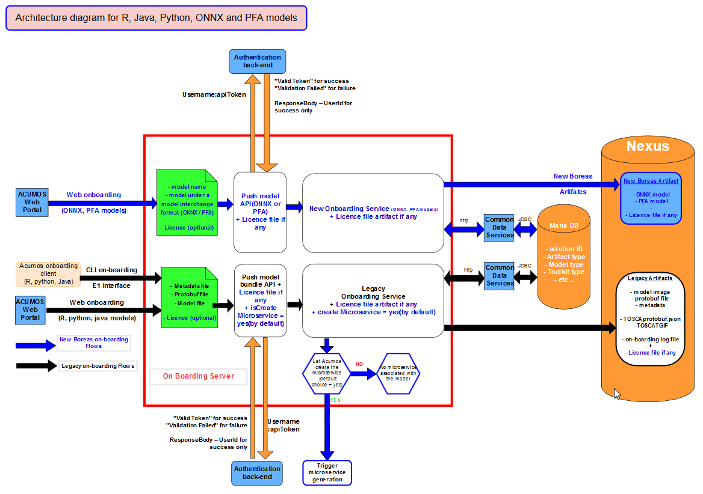

.. ===============LICENSE_START=======================================================
.. Acumos CC-BY-4.0
.. ===================================================================================
.. Copyright (C) 2017-2018 AT&T Intellectual Property & Tech Mahindra. All rights reserved.
.. ===================================================================================
.. This Acumos documentation file is distributed by AT&T and Tech Mahindra
.. under the Creative Commons Attribution 4.0 International License (the "License");
.. you may not use this file except in compliance with the License.
.. You may obtain a copy of the License at
..
.. http://creativecommons.org/licenses/by/4.0
..
.. This file is distributed on an "AS IS" BASIS,
.. WITHOUT WARRANTIES OR CONDITIONS OF ANY KIND, either express or implied.
.. See the License for the specific language governing permissions and
.. limitations under the License.
.. ===============LICENSE_END=========================================================

===========================
On-Boarding Developer Guide
===========================

This is the developers guide to Onboarding.

**1: introduction - What is Onboarding?**
-----------------------------------------

Acumos is intended to enable the use of a wide range of tools and technologies in the development
of machine learning models including support for both open sourced and proprietary toolkits.

The goal of Onboarding is to provide an ingestion interface, by web or CLI(command line interface)
for various types of models and to create required artifacts and identifiers to enter the  Acumos
machine learning platform.

#. Legacy models

	As for Athena release, in Boreas you can on-board models developped in Java 8 or 9, Python>=3.5, <3.7,
	R>=3.4.4 and sourced from toolkits such as Scikit, TensorFlow, H2O, and R. But in Boreas you can choose
	to create or not the microservice at the end of the on-boarding process. If user choose to not create
	the microservice at teh end of on-boarding he can create it later.

	In short, our goals for these kinds of models are to generate or provide all the necessary materials
	required to use these kinds of models with the others components of Acumos like :

	- Tosca file for Design studio

	- Represent model I/O such for microservice generation

	- SolutionID for CDS

	- Licence file for licensing management

#. Since Boreas, we are able to on-board news kinds of model like :

	- model in onnx format : model.onnx
	- model in pfa format : model.pfa
	- Dockerized model : model dockerised by Data scientist himself
	- Docker model URI : URI of Dockerized model stored in external repo like Docker-Hub for example

	For this new kinds of model, Micro service generation and Design studio capabilities are not available.

#. Acumos capabilities by models type

	This table sum-up all the Acumos capabilities available for each kinds of model

+------------------+--------------------------+---------------+--------------+-----------------------+-------------+
|   Model          | Micro-service generation | Design studio | Market place | on-board with license |on-boarding  |
+==================+==========================+===============+==============+=======================+==============
| R model          | Available                |Available      |Available     |Available              | Web and CLI | 
+------------------+--------------------------+---------------+--------------+-----------------------+--------------
| Pyhton model     | Available                |Available      |Available     |Available              | Web and CLI |
+-----------+------+--------------------------+---------------+--------------+-----------------------+-------------+
| Java model       | Available                |Available      |Available     |Available              | Web and CLI |
+------------------+--------------------------+---------------+--------------+-----------------------+-------------+
| ONNX model       | Not available            |Not available  |Available     |Available              | Web only    |
+------------------+--------------------------+---------------+--------------+-----------------------+-------------+
| PFA model        | Not available            |Not available  |Available     |Available              | Web only    |
+------------------+--------------------------+---------------+--------------+-----------------------+-------------+
| Dockerized model | Not applicable           |Not available  |Available     |Not available          | Web only    |
+------------------+--------------------------+---------------+--------------+-----------------------+-------------+
| URI model        | Not applicable           |Not applicable |Available     |Available              | Web only    |
+------------------+--------------------------+---------------+--------------+-----------------------+-------------+

**2: Target Users**
-------------------

This guide is targeted towards the open source user community that:

1. Intends to understand the backend functionality of the Onboarding.

2. Intends to contribute code to enhance the functionality of the Onboarding.

**3: Assumptions**
------------------

It is assumed that the ML Models contributed by the open source community an created under Java 8 or
9, Python>=3.5, <3.7 or R>=3.4.4  :

1. Provide the basic request response style of communication.

2. Can be converted in Microservices.

3. Are capable of communicating via Http REST mechanism.

**4: Onboarding High level Design Architecture**
------------------------------------------------
Below is high-level flow of model onboarding

|image1|

For models developed in Java, Python and R the data scientist will use the Acumos client library to
create some artifacts embeded them in a model bundle. This model bundle can be pushed to the platform
by using WEB on-boarding or command line (CLI) thanks to REST interface exposed by the Acumos
onboarding server.

|image1bis|

For model in a model interchange format like ONNX and PFA only web interface is useable to upload
them in the platform. For the moment micro-service generation cannot be triggered for ONNX and PFA
models. 

|image1ter|

For model Dockerized and store in repo outside Acumos (like for example Docker hub) you can save the
model URI in Acumos. You can also dockerized your models by yourself and on-board them in Acumos.

**5: Onboarding Low Level Design**
----------------------------------

- R, Java, Python, ONNX and PFA models
--------------------------------------

For models created with R, Java or Python, Data scientists must use Acumos-client-library specific
to the toolkit type to push the model to Acumos platform. The client library creates first the model
bundle composed of model binary, metadata file and protobuf definition for model input/output. Then
data scientists can choose to onboard the model bundle by WEB on-boarding or CLI on-boarding
(Common Line Interface). The onboarding server invokes TOSCA generator to generate TOSCA files for the
model and uploads these to Nexus. Onboarding server authenticates incoming request and then pushes
model artifacts to nexus docker registry. By default micro-service is created but modelers have the
possibility to skip this step and do it later . When Onboarding server invokes microservice generation
API to generate docker image for the model, the microservice generation component creates docker image
and uploads it in Nexus docker repository.

For models in a model interchange format like ONNX or PFA, only web onboarding can be used as there
is no specific Acumos-client-library for these kinds of models. In that case, modeller has to use the
web onboarding interface to upload their model. Onboarding server authenticates incoming request and
then pushes the model to nexus.

Data scientists can also on-board a license file (license.json) that will be part of the models artefacts.
After onboarding the model with license, the artifacts will show license file with name "license.json"
even if user has uploaded the license file with different name

- Architecture diagramm for R, Java, Python, ONNX and PFA models

|image0|

- On-boarding use case

Below, the data scientist’s model is wrapped to produce a standardized native model. Depending on
the input model, only a subset of standard model interfaces may be supported.

Acumos can then generate a microservice however it wishes. The underlying generic server can only
interface with the inner model via the wrapper. This decoupling allows us to iterate upon and
improve the wrapper independently of Acumos.

|image3|

- On-boarding Model Artefact

Model artifacts must provide sufficient metadata that enables Acumos to instantiate runtimes,
generate microservices, and validate microservice compositions. The proposed solution is to split
the model artifact into public and private components.

Public :

- Understood by  Acumos. Includes metadata on:

- Model methods and signatures

- Runtime information

Private :

- Opaque to  Acumos but understood by the wrapper library.

- Includes: Serialized model

- Auxiliary artifacts required by wrapper library

- Auxiliary artifacts required by model

By splitting the artifact into public and private pieces, the wrapper library has the freedom to
 independently iterate and improve.

|image4|

- Dockerized model and Dockerized model URI
-------------------------------------------

Data scientist can also create models in the language of their choice then dockerized their models
themselves and onboard these dockerized models or dockerized model URI. Of course for these kinds of
models the microservice generation process is not triggered. Below is the low level design for these
models.

Data scientists can on-board a license, in the same way as previously explained, only with the Dockerized
model URI as we assume that for Dockerized model the license has been embeded in the Docker image.

- Architecture diagramm for Dockerized model and Dockerized model URI

|image0bis|

Whatever the kinds of models :

- New solution is created in common database for a new model.
- Existing solution is updated with, a new revision. Revision is updated with artefact details and
those artefacts are uploaded to nexus maven repository.

**7 Onboarding Model Artifact**
-------------------------------

**8 Onboarding Setup**
----------------------

Steps:

1. Clone the code from Gerrit Repo: https://gerrit.acumos.org

Under the dashboard page we have list of Projects, select Onboarding Project and clone this project
by using below clone command:

git clone https://<GERRIT_USER_NAME>@gerrit.acumos.org/r/on-boarding.git

or by ssh git clone ssh://<GERRIT_USER_NAME>@gerrit.acumos.org:29418/on-boarding

2. After cloning import this project in your recommended IDE like STS.

3. Take the maven update so that you can download all the required dependencies for the Onboarding
Project.

4. After doing maven update you can run or debug the code by using Spring Boot App but before that
we need to set the Environment Variables in our IDE tool for local testing and if you want to read
the environment variables once you deployed your code on the dev or IST server than you need to set
all the environment variables in system-integration Project.

**9: Onboarding Technology & Framework**
----------------------------------------

-  Java 1.8

-  Spring Boot

-  Spring REST

-  Docker Java Library

**10: Onboarding – Code Walkthrough & details**
-----------------------------------------------

In Onboarding project we have template folder under resources where we are putting all the Docker
file with some other dependencies for different Models like h20,java_argus,java_genric,,python,r ,etc.

For example:

For Onboarding H20 model we have the h20 Docker file and requirement.txt file attached below inside
h20 folder.

Onboarding code understands this Docker file related to particular model line by line it reads the
commands and performs the action accordingly. It will download all the required dependences
accordingly. In this way we’ll Onboard Model by using this Onboarding Platform.

Note: Make sure the Docker is installed in the local Machine before try to Onboard the model in by
using our local machine Environment.

**11: Onboarding – Model Validation Workflow**
----------------------------------------------

Following steps needs to be executed as part of model validation workflow:

-   Onboarding server will expose an REST API for validating the model. The REST API will take
    solutionID and metadata JSON containing model features as input parameters

-  The server will fetch the docker image details for the corresponding solution and run the modelimage.

-  The input metadata JSON features will be send to predict API exposed by model docker image and
   output of predict method will be returned as API output.

**12: Onboarding Backend API**
------------------------------

**Validate API-Token API** : This API provide an API Token (available in the user settings) that can be
used to onboard a model

- Portal will expose  validateApiToken

- URL=http://{HOST}/auth/validateApiToken

- input:apiToken , Username

- output:ResponseDetail  -- "Valid Token" for success /  "Validation Failed" for failure

- ResponseBody: UserId for success only

Portal Webonboarding will  pass access_token = username:apitoken in the header  "Authorization"
Request to Onboarding Onboarding will use the Header Info to get the Username + apitoken

**Authentication API** : This API provides a JWT token that can be used to onboard a model

- URL=http://hostname:ACUMOS_ONBOARDING_PORT/onboarding-app/v2/auth

- Method = GET.

- input : User_Name, Password.

- output : authentication token.

- hostname : the hostname of the machine in which Acumos have been installed.

- ACUMOS_ONBOARDING_PORT : You can retrieve the value of this variable in the acumos-env.sh file.

- Description : Checks User Name & password to provide an authentication token.

**Push model bundle API** : This API is used for upload the model bundle in Acumos

- URL=http://hostname:ACUMOS_ONBOARDING_PORT/onboarding-app/v2/models

- Method = POST

- data Params :

	- model (Required - file for model bundle model.zip to onboard, Parameter Type - formdata)
	- metadata (Required - model.protobuf file for model to onboard, Parameter Type - formdata)
	- schema (Required - metadata.json file for model, Parameter Type - formdata)
	- license (optional parameter - license.json associated with model, Parameter Type - formdata)
	- Authorization(Optional - jwt token or username:apitoken, Parameter Type - header)
	- isCreateMicroservice (Optional - boolean value to trigger microservice generation, default=true, Parameter Type - header)
	- tracking_id (Optional - UUID for tracking E2E transaction from Portal to onboarding to microservice generation, Parameter Type - header)
	- provider (Optional - for portal authentication, Parameter Type - header)
	- shareUserName (Optional - User Name for sharing the model as co-owner, Parameter Type - header)
	- modName (Optional - Model Name to be used as display name else Model name from metadata is used, Parameter Type - header)
	- deployment_env (Optional - Identify deployment environment for model as DCAE or non-DCAE, default is non-DCAE, Parameter Type - header)
	- Request-ID (Optional - UUID received from Portal else generated for tracking transaction in CDS, Parameter Type - header)

- hostname : the hostname of the machine in which Acumos have been installed.

- ACUMOS_ONBOARDING_PORT : You can retrieve the value of this variable in the acumos-env.sh file.

- Description : Upload the model bundle on the on-boarding server.

**Push model API** : This API is used by web onboarding only to upload ONNX and PFA models in Acumos

- URL = http://hostname:ACUMOS_ONBOARDING_PORT/onboarding-app/v2/advancedModel

- Method = POST

- data params :
	
	- model (Optional - file for model to onboard - ONNX/PFA file, Parameter Type - formdata)
	- license (optional parameter - license.json associated with model, Parameter Type - formdata)
	- modelname (Required - Model Name to be used as display name, Parameter Type - header)
	- Authorization (jwt token or username:apitoken, Parameter Type - header)
	- isCreateMicroservice (boolean value to trigger microservice generation, default=false, Parameter Type - header)
	- dockerfileURL (Optional - if docker URL is given then file is not necessary, Parameter Type - header)
	- provider (optional parameter - for portal authentication, Parameter Type - header)
	- tracking_id (optional parameter - UUID for tracking E2E transaction from Portal to onboarding to microservice generation, Parameter Type - header)
	- Request-ID (optional parameter - UUID received from Portal else generated for tracking transaction in CDS, Parameter Type - header)
	- shareUserName (optional parameter - User Name for sharing the model as co-owner, Parameter Type - header)

- hostname : the hostname of the machine in which Acumos have been installed.

- ACUMOS_ONBOARDING_PORT : You can retrieve the value of this variable in the acumos-env.sh file

.. |image0_old| image:: ./media/DesignArchitecture.png
   :width: 5.64583in
   :height: 5.55208in
.. |image1| image:: ./media/HighLevelFlow.png
   :width: 7.26806in
   :height: 2.51389in
.. |image1bis| image:: ./media/HighLevelFlow1bis.png
   :width: 7.26806in
   :height: 1.2in
.. |image1ter| image:: ./media/HighLevelFlow1ter.png
   :width: 7.26806in
   :height: 1.2in
.. |image2| image:: ./media/LowLevelDesign.png
   :width: 6.26806in
   :height: 2.43333in
.. |image3| image:: ./media/UseCase.png
   :width: 6.26806in
   :height: 3.0375in
.. |image4| image:: ./media/ModelArtifact.png
   :width: 6.26806in
   :height: 2.5in

.. |image0bis| image:: ./media/ArchitectureDiagram2.png

