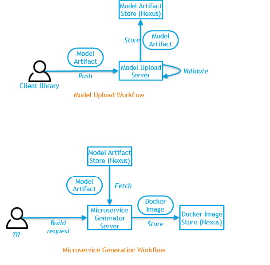

.. ===============LICENSE_START=======================================================
.. Acumos CC-BY-4.0
.. ===================================================================================
.. Copyright (C) 2017-2018 AT&T Intellectual Property & Tech Mahindra. All rights reserved.
.. ===================================================================================
.. This Acumos documentation file is distributed by AT&T and Tech Mahindra
.. under the Creative Commons Attribution 4.0 International License (the "License");
.. you may not use this file except in compliance with the License.
.. You may obtain a copy of the License at
..
.. http://creativecommons.org/licenses/by/4.0
..
.. This file is distributed on an "AS IS" BASIS,
.. WITHOUT WARRANTIES OR CONDITIONS OF ANY KIND, either express or implied.
.. See the License for the specific language governing permissions and
.. limitations under the License.
.. ===============LICENSE_END=========================================================

===========================
On-Boarding Developer Guide
===========================

1. Introduction
---------------

This is the developers guide to Onboarding.

**1.1 What is Onboarding?**

Acumos is intended to enable the use of a wide range of tools and
technologies in the development of machine learning models including
support for both open sourced and proprietary toolkits. Models can be
easily onboarded and wrapped into containerized microservices which are
interoperable with many other components.

The goal of Onboarding is to provide an ingestion interface for various
types of models to enter the  Acumos machine learning platform. Examples
of models include well-defined objects such as scikit-learn estimators,
TensorFlow weights, and arbitrary R functions.

The solution for accommodating a myriad of different model types is to
provide a custom wrapping library for each runtime. The wrapper 
will encapsulate the complexity surrounding the serialization and
deserialization of models. Additionally, the wrapper will provide a 
common native interface for invoking the inner model.

In order for  Acumos to be able to reason about models uniformly, there
will also have to be a common model interface description. E.g.  
what are the available model methods, and what do they look like? One
goal of  Acumos is to instantiate ML models as microservices and safely
compose them together. We must collect enough model metadata to enable
this.

In short, our goals are to:

- Create wrapper libraries that can serialize/deserialize models and provide a standard native interface.

- Represent model I/O such that  Acumos can generate microservices and validate connections between them.

**1.2 Target Users**

This guide is targeted towards the open source user community that:

1. Intends to understand the backend functionality of the Onboarding.

2. Intends to contribute code to enhance the functionality of the Onboarding.

**1.3 Assumptions**

It is assumed that the ML Models contributed by the open source
community:

1. Provide the basic request response style of communication.

2. Can be converted in Microservices

3. Are capable of communicating via Http REST mechanism.

4. Are developed in Java, Python 3.0, R and sourced from toolkits such as Scikit, TensorFlow, H2O, and RCloud.

**1.4 Onboarding Design Architecture**

|image0|

The modeler will create model using various technologies (toolkits) and
use the  Acumos client library to upload model to platform. Acumos
onboarding server exposes REST interface, which is used by client
library for uploading the model to platform.

|image1|

**1.5 Onboarding Low Level Design**

Modeler/Data scientist creates model using toolkit. Modeler uses
Acumos-client-library to push the model to  Acumos platform. The client
library uploads model and metadata file to  Acumos onboarding
server.Onboarding server creates docker image of model and push to nexus
docker registry.It also creates solution, puts model and metadata
artifact to repository.

|image2|

**1.6 Onboarding Use Case**

Below, the data scientist’s model is wrapped to produce a standardized
native model. Depending on the input model, only a subset of 
standard model interfaces may be supported.  

Acumos can then generate a microservice however it wishes. The
underlying generic server can only interface with the inner model via
the wrapper. This decoupling allows us to iterate upon and improve the
wrapper independently of Acumos.

|image3|

**1.7 Onboarding Model Artifact**

Model artifacts must provide sufficient metadata that enables  Acumos to 
instantiate runtimes, generate microservices, and validate microservice 
compositions. The proposed solution is to split the model artifact into
public and private  components.

- Public

- Understood by  Acumos. Includes metadata on:

- Model methods and signatures

- Runtime information

- Private

- Opaque to  Acumos but understood by the wrapper library.

- Includes: Serialized model

- Auxiliary artifacts required by wrapper library

- Auxiliary artifacts required by model

By splitting the artifact into public and private pieces, the wrapper
library has the freedom to independently iterate and improve.

|image4|

**1.8 Onboarding Setup**

Steps:

1. Clone the code from Gerrit Repo:

Repo URL: https://gerrit.acumos.org

Under the dashboard page we have list of Projects,select Onboarding
Project and clone this project by using below clone command:

git clone https://<GERRIT_USER_NAME>@gerrit.acumos.org/r/on-boarding.git

2. **After cloning import this project in your recommended IDE like STS.**

3. Take the maven update so that you can download all the required
   dependencies for the Onboarding Project.

4. After doing maven update you can run or debug the code by using
   Spring Boot App but before that we need to set the Environment
   Variables in our IDE tool for local testing and if you want to read
   the environment variables once you deployed your code on the dev or
   IST server than you need to set all the environment variables in
   system-integration Project.

**1.9 Onboarding Technology & Framework**

-  Java 1.8

-  Spring Boot

-  Spring REST

-  Docker Java Library

**1.10 Onboarding – Code Walkthrough & details**

In Onboarding project we have template folder under resources where we
are putting all the Docker file with some other dependencies for
different Models like h20,java_argus,java_genric,,python,r ,etc.

For example:

For Onboarding H20 model we have the h20 Docker file and requirement.txt
file attached below inside h20 folder.

Onboarding code understands this Docker file related to particular model
line by line it reads the commands and performs the action accordingly
.It will download all the required dependences accordingly. In this way
we’ll Onboard Model by using this Onboarding Platform.

Note: Make sure the Docker is installed in the local Machine before try
to Onboard the model in by using our local machine Environment.

**1.11 Onboarding – Docker Image Creation and details**

The onboarding server exposes REST API for model and metadata upload.

The metadata JSON is validated for valid schema using JSON schema
validator.The model metadata is used to get the runtime version
information, for example python 2.7. This information is used to fetch
the runtime template. The runtime template contains template for
following files

1.Dockerfile

2.requirements.txt

3.app.py

4.swagger.yaml

Below is the structure:

|image5|

The above template files are populated based on metadata JSON uploaded
by user.Onboarding server uses docker-java library for model docker
image creation. Once the docker image is created, the image is tagged
and pushed to nexus docker registry.The server uses common data
micro-services API to create solution and store model and metadata to
artifact repository.

**1.12 Onboarding – Model Validation Workflow**

Following steps needs to be executed as part of model validation
workflow:

-  Onboarding server will expose an REST API for validating the model.
   The REST API will take solutionID and metadata JSON containing model
   features as input parameters

-  The server will fetch the docker image details for the corresponding
   solution and run the model image.

-  The input metadata JSON features will be send to predict API exposed
   by model docker image and output of predict method will be returned
   as API output.

**1.13 Onboarding Backend API**

-OnboardingWithAuthentication:-

This API provides the basic authentication prior to Onboard any model.

-dockerizePayload:

This API is used for actual Onboarding the Models.

It gets invoked after the successful authentication.

.. |image1| image:: ./media/HighLevelFlow.png
   :width: 6.26806in
   :height: 1.51389in
.. |image2| image:: ./media/LowLevelDesign.png
   :width: 6.26806in
   :height: 2.43333in
.. |image3| image:: ./media/UseCase.png
   :width: 6.26806in
   :height: 3.0375in
.. |image4| image:: ./media/ModelArtifact.png
   :width: 6.26806in
   :height: 2.5in
.. |image5| image:: ./media/DockerFileStructure.png
   :width: 3.90625in
   :height: 4.94792in
